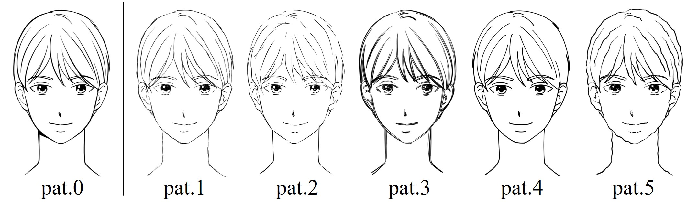

# NTT lineart dataset

This repository includes the lineart introduced by the following paper: F. Xie, M. Takagi, H. Seshimo and Y. Aono, "Refining Line Art from Stroke Style Disentanglement with Diffusion Models," in IEEE Access, doi: 10.1109/ACCESS.2023.3347551.
The lineart dataset consists of three components: lineart images, mask, and point annotations.

The paper link is [here](https://ieeexplore.ieee.org/document/10374353).



**Picture:**  *An example of lineart dataset.*


# Dataset Format

Our datasets consist of images (ground truth and five patterns), facial land marks and mask on drawing area. 

This diverse dataset include linearts by 12 professional artists. We limited the target object to frontal face drawings in specified patterns. The line artwork in six patterns, one is used as a sophisticated pattern (ground truth), and the other five are mediocre patterns with five kinds of stroke details. All of the artists drew the artworks of 10 characters using clear lines in their own style, which are taken as sophisticated data. Starting from the sophisticated types, all artists drew five kinds of line artwork with different stroke details.

Our summarization on mediocre pattern is based on an Japanese art textbook. We define mediocre patterns as fuzzy, casual, overlapping, lacking strength, and hand-shaking.


<pre>
Pat.1 fuzzy: carefully connecting short lines little by little makes the lines look weak and messy.
Pat.2 casual: trying to draw vigorously leads to a lot of broken bent lines that have uneven thickness and length.
Pat.3 overlap: lots of long lines stacked on top of each other which looks messy.
Pat.4 no strength: no variance in the line thickness gives the feeling of rigidity.
Pat.5 hand-shaking: drawing slowly and carefully yields soggy lines.
</pre>


# Citation
You can cite it as follows:
```bibtex
@ARTICLE{10374353,
  author={Xie, Fanglu and Takagi, Motohiro and Seshimo, Hitoshi and Aono, Yushi},
  journal={IEEE Access}, 
  title={Refining Line Art From Stroke Style Disentanglement With Diffusion Models}, 
  year={2024},
  volume={12},
  number={},
  pages={9526-9535},
  keywords={Feature extraction;Art;Training;Proposals;Probabilistic logic;Noise reduction;Image synthesis;Disentangled representation;image generation;line art refinement;denoising diffusion probabilistic models},
  doi={10.1109/ACCESS.2023.3347551}}
```# lineart_dataset
